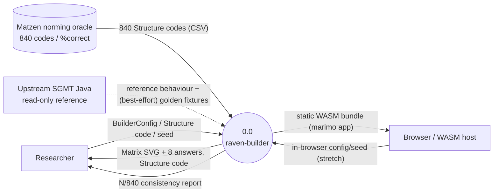

# Context Diagram (Level 0)

> System boundary: raven-builder (SGMT Python port, v1)

> **Status note:** This is a greenfield bootstrap from the design plan. All
> citations are prospective — they point at the design plan
> (`docs/design-plans/2026-06-08-raven-builder.md`), not yet at code. Replace
> with `file::symbol, commit` citations as implementation lands.

## Diagram

## External Entities

| Entity | Description | Inputs to System | Outputs from System |
|--------|-------------|-----------------|---------------------|
| Researcher | The human reproducing/constructing matrix stimuli, via the Python API, the typer CLI, or the marimo app | `BuilderConfig` or `Structure` code + seed | Matrix SVG + 8 answer choices, the `Structure` code, an `N/840` oracle report (`docs/design-plans/2026-06-08-raven-builder.md`, pending-commit) |
| Matzen norming oracle | The committed `data/ravens_oracle.csv` extracted from the published xls (840 stimuli) | 840 `Structure` codes + `%correct` | Consumed by the structural-oracle harness (`docs/design-plans/2026-06-08-raven-builder.md`, pending-commit) |
| Upstream SGMT Java | The read-only Java the port is derived from; also the source of best-effort golden fixtures (Phase-1 spike) | Reference behaviour; optional captured fixtures | — (dev-time only) (`docs/design-plans/2026-06-08-raven-builder.md`, pending-commit) |
| Browser / WASM host | Pyodide-in-browser hosting the marimo app (concluding phase) | The exported static bundle + the `raven-matrix` PyPI wheel | An interactive in-browser UI (`docs/design-plans/2026-06-08-raven-builder.md`, pending-commit) |

## System Boundary

**In scope:** the explicit matrix *builder* (option parity with `SGMBuilderFrame`),
`java.util.Random` port, structure features + location transforms, labeller +
parser + structural oracle, SVG rendering, compat toggles, the typer CLI, the
marimo app, and its WASM export.

**Out of scope (deferred):** the difficulty classifier, the random batch
`SGMMatrixSetGenerator`, and the normative oracle (a later release, own
`difficulty` dependency group). Exact pixels / distractor sets / JVM-byte-
identical RNG (need unpublished seeds).

## Cross-References

- **Parent:** None (top-level diagram)
- **Children:** none yet (decompose subsystems — builder, labeller/oracle,
  renderer, UI — when code lands)
- **Related issues:** None
- **Related commits:** to be added on first implementation commit
